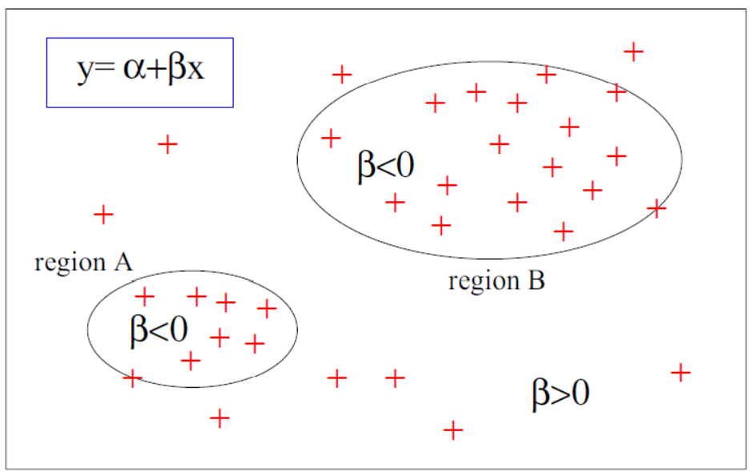
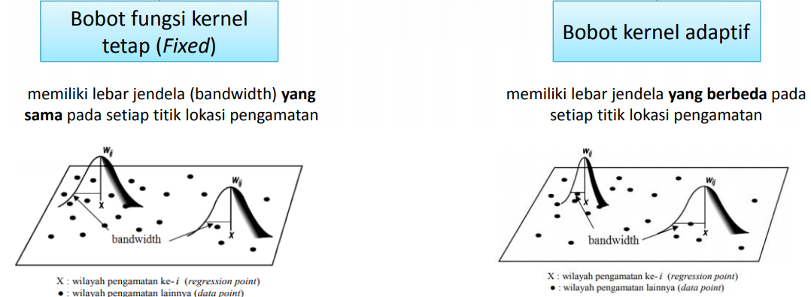

```{r setup, include=FALSE}
knitr::opts_chunk$set(echo = TRUE, 
                      warning = F,
                      message = F)
options(scipen = 99)
```

# Latar Belakang{.tabset}

Virus corona (COVID-19) yang disebabkan oleh virus *severe acute respiratory syndrome coronavirus* 2 (SARS-CoV-2) yang berdampak merugikan hampir pada semua sektor kehidupan. Indonesia sendiri menjadi negara yang terkena dampak sangat parah dari penyebaran virus ini mulai dari sektor ekonomi, pariwisata, pendidikan, kesehatan, dan sektor vital lainnya semenjak kemunculannya pertama kali terkonfirmasi pada bulan Maret 2019. Terhitung sampai tanggal 25 Agustus 2021, kumulatif kasus positif yang terdeteksi dan tercatat pada database Kementerian Kesehatan Republik Indonesia adalah sebanyak 
4,026,837 dengan jumlah kasus positif aktif sebesar 257,677; kasus kumulatif sembuh terkonfirmasi sebesar 3,639,867; dan kasus kumulatif meninggal terkonfirmasi sebesar 129,293 jiwa. Fluktuasi angka kasus positif dan meninggal sudah selayaknya menjadi tugas pemerintah untuk melakukan pengkajian sebagai upaya menekan laju penyebaran virus corona ini. Berbagai upaya juga sudah dilakukan oleh pemerintah seperti pengadaan layanan fasilitas kesehatan yang diperbanyak untuk setiap daerah, pengadaan pembatasan dan keluar-masuk wilayah tertentu, pengadaan vaksin, dan upaya lainnya. 

Laju penyebaran virus corona di Indonesia tentunya memberikan kajian tersendiri untuk setiap daerah (bisa dalam cakupan provinsi, kabupaten, kecamatan, ataupun kelurahan) yang ada. Akan tetapi, sederhananya untuk menenentukan suatu daerah harus diperketat atau tidak kita bisa memanfaatkan analisis regresi yang memberikan hasil kajian secara global. 

Dalam analisis regresi sendiri, salah satu asumsi yang diperlukan adalah antar pengamatan harus saling bebas dalam artian tidak terdapat hubungan satu sama lain. Sementara kondisi pengetatan suatu wilayah sangat mungkin dipengaruhi oleh lokasi pengamatan atau kondisi geografis wilayah, termasuk posisinya terhadap wilayah lain di sekitarnya. Hal ini akan menyebabkan asumsi kebebasan antar pengamatan dalam analisis regresi (global) sulit terpenuhi. Regresi Terboboti Geografis (Geographical Weighted Regression / GWR) bisa menjadi salah satu solusi yang dapat digunakan untuk membentuk analisis regresi namun bersifat lokal untuk setiap lokasi pengamatan dalam kasus yang telah disebutkan sebelumnya.

## Library Setup

```{r}
# data wrangling
library(dplyr)
library(stringr)

# visualisasi
library(leaflet)
library(RColorBrewer)
library(htmlwidgets)

# spasial objek
library(sp)
```

## Training Objective

* **Pengenalan Geographical Weighted Regression (GWR)**
  + Pengenalan GWR
  + Simpson's Paradox
  + Bandwith Optimum
  + Model Regresi Linear vs GWR
  
* **Pembobotan Spasial**
* **GWR Model**

***

# Pengenalan Geographical Weighted Regression (GWR)

Analisis regresi adalah metode statistika paling umum dan sederhana yang digunakan untuk memprediksi sebuah nilai(numerik) secara supervised learning. Metode ini banyak diaplikasikan untuk menyelesaikan permasalahan umum di bidang ekonomi ataupun bidang keilmuan lainnya. Metode regresi pada umumnya mempertimbangkan berbagai nilai numerik ataupun kategorik sebagai data pendukung untuk memprediksi nilai target. Pada kasus tertentu, kita juga bisa menambahkan data spasial untuk digunakan dalam analisis regresi. Berbeda dengan regresi pada umumnya, dalam hal ini regresi nantinya akan mempertimbangkan aspek kewilayahan yang memberikan pengaruh lingkungan dan karakteristik yang muncul dari suatu wilayah. 

Data spasial sendiri adalah data cross-section yang memiliki struktur geografis berupa longitude dan latitude dan dapat divisualisasikan dalam bentuk peta. Berdasarkan Hukum I Tobler, segala sesuatu saling berhubungan satu dengan yang lainnya, tetapi sesuatu yang lebih berdekatan akan lebih berpengaruh daripada sesuatu yang jauh. Hukum Tobler digunakan sebagai pilar analisis data spasial. Pada data spasial, seringkali pengamatan di suatu lokasi bergantung pada pengamatan di lokasi lain yang berdekatan.

Regresi Terboboti Geografis (RTG) adalah metode yang dapat digunakan untuk menganalisis aspek heterogenitas spasial antar variabel. Model regresi terboboti geografis berangkat dari model regresi linear klasik dengan melibatkan hubungan antar variabel berdasarkan aspek ruang. Model yang dihasilkan menggunakan regresi linear klasik merupakan model global yang berarti pendugaan parameter yang dihasilkan berlaku untuk seluruh observasi. Regresi linear klasik dengan Ordinary Least Square (OLS) tidak mempertimbangkan aspek ruang atau efek spasial yang timbul. Hal ini dapat mengakibatkan interpretasi yang keliru terhadap model yang dihasilkan. Simpson’s Paradox adalah salah satu fenomena yang muncul pada kasus statistik yang dapat mengakibatkan kekeliruan pengambilan kesimpulan. Fenomena ini terjadi ketika suatu group data yang dianalisis antara secara terpisah dan secara penggabungan memiliki hasil yang kontradiktif.

[**Simpson's Paradox**](https://anatomisebiostats.com/biostatistics-blog/simpsons-paradox-hidden-bias/)


Dalam pemodelan kasus regresi linear klasik yang melibatkan ruang, model yang dihasilkan dapat berhadapan dengan Simpson's Paradox karena bersinggungan dengan data yang melalui agregasi. Setiap observasi dalam pemodelan regresi yang melibatkan ruang memiliki kemungkinan menghasilkan pendugaan parameter yang berbeda ketika pemodelan yang dilakukan bersifat global.
Regresi terboboti geografis dapat menangani permasalahan yang muncul akibat misinterpretasi saat melakukan pemodelan regresi linear klasik karena adanya keragaman spasial dalam data[^1]. Output yang muncul pada pemodelan regresi terboboti spasial adalah setiap observasi yang berbasis ruang memiliki model regresi masing-masing.

```{r echo=FALSE}

```


Model regresi global dapat dinyatakan sebagai berikut:


$$y_{i} = \beta_{0} + \sum_{k=1}^p \beta_{k}x_{ik} + \varepsilon_{i}$$


Melalui regresi terboboti geografis, model regresi tersebut dapat digunakan untuk menduga parameter lokal dengan model umum sebagai berikut:


$$y_{i} = \beta_{0}(u_{i},v_{i}) + \sum_{k=1}^p \beta_{k}(u_{i},v_{i})x_{ik} + \varepsilon_{i}$$

dengan:

* $y_{i}$                  : Variabel target untuk setiap lokasi ke-i
* $(u_{i},v_{i})$          : Titik koordinat lokasi ke-$i$ dalam bentuk longitude dan latitude
* $\beta_{k}(u_{i},v_{i})$ : Nilai koefisien regresi untuk variabel prediktor ke-$k$ dan lokasi ke-$i$
* $\varepsilon_{i}$        : Nilai residual regresi antara variabel prediktor dengan variabel target di lokasi ke-$i$


Model regresi yang dihasilkan melalui RTG berguna ketika hendak dilakukan eksplorasi suatu variabel beserta pengambilan keputusannya pada daerah tersebut berdasarkan variabel-variabel yang diteliti. Karena setiap daerah memiliki model masing-masing, maka pengambilan kebijakan pada satu daerah akan berbeda dengan daerah lainnya.

Untuk mendeteksi aspek keragaman spasial yang muncul dapat dilakukan menggunakan uji Breusch-Pagan dengan statistik uji sebagai berikut:

$$BP = \frac{1}{2}h^{'}y(y^{'}y)^{-1}y^{'}h$$

dengan 

$$h = (\frac{\epsilon_{i}^{2}}{\sigma^{2}} - 1)$$


Vektor observasi variabel target dinyatakan sebagai $y$ sedangkan $\epsilon_{i}^{2}$ adalah kuadrat error pengamatan ke-$i$ dan $\sigma^{2}$ adalah varians dari $\epsilon_{i}$

Setelah dilakukan uji Breush-Pagan dan hasil yang ditunjukan adalah keragaman spasial yang signifikan maka pemodelan dengan regresi terboboti geografis dapat dilakukan. Pada model regresi terboboti geografis setiap lokasi memiliki parameter persamaan yang berbeda sehingga banyaknya model regresi yang diduga adalah sebagai obervasi yang digunakan dalam data.

# Pembobot Spasial

Dalam melakukan analisis spasial, dibutuhkan suatu pembobot spasial berdasarkan aspek ketetanggaan atau aspek jarak. Pembentukan pembobot spasial ini bersifat penting karena akan mempengaruhi hasil analisis regresi spasial yang dibentuk. Pembobotan ini akan disimpan ke dalam suatu matriks W yang kemudian bernama matriks pembobot spasial. Adapun beberapa konsep pembobotan spasial yang biasa digunakan diantaranya:

1. *Critical cut of Neighbourhood*
  
   Dua lokasi yang memiliki koordinat easting-northing $s_{i}$ dan $s_{j}$ dianggap      bertetangga jika $0\le d_{ij} \le d^{*}$ dengan $d_{ij}$ adalah jarak antarlokasi dan $d^{*}$ mewakili jarak critical cut off.

2. $k^{th}$ *Nearest Neighbour* (Tetangga terdekat)

   Melibatkan lokasi terdekat dengan membertimbangkan nilai $k$ yang dipilih. Untuk lokasi $i$ yang terdekat dengan lokasi $j$ akan dipilih jika lokasi $i$ masih dalam urutan $k$ jarak terdekat dalam unit pengamatan.

3. *Contiguity Based Neighbourhood* (Ketetanggaan berbasis persinggungan)

   Dua lokasi berkoordinat $s_{i}$ dan $s_{j}$ disebut bertetangga jika saling berbagi batas wilayah.
   

Dalam melakukan pembobotan untuk regresi terboboti geografis, akan digunakan suatu fungsi kernal yaitu fungsi pembobot kernel Gaussian dengan persamaan sebagai berikut:

$w_{ij} = exp \ [\frac{-1}{2}(\frac{d_{ij}}{b})^2]$

$d_{ij}$ adalah jarak antara dua lokasi yaitu $i$ dan $j$ dan $b$ adalah lebar jendela (bandwidth). Bandwidth dapat dianalogikan sebagai suatu titik dalam lingkaran yang memiliki efek mempengaruhi area sekitar yang masih berada dalam area tersebut. Hal ini mempengaruhi pendugaan parameternya di lokasi ke-$i$. Bandwith terbagi menjadi dua yaitu memiliki efek sama pada setiap lokasi pengamatan (fixed) dan berbeda pada setiap lokasi pengamatan (adaptif).


```{r echo=FALSE}

```


Metode yang dapat digunakan untuk menentukan nilai *bandwidth optimum* adalah dengan menggunakan validasi silang (*cross validation*). Adapun persamaan untuk mendapatkan CV adalah sebagai berikut:

$$CV = \Sigma_{i=1}^{n}[y_{i} - \hat{y}_{\ne i}(b)]^2$$

$\hat{y}_{\ne i}(b)$ adalah nilai dugaan $y_{i}$ pada observasi di lokasi ke-$i$ dihilangkan dalam pendugaan. Bandwidth optimum akan dicari melalui serangkaian iterasi sehingga didapatkan bandwidth bernilai minimum.

# Import Data dan Eksplorasi Data

Data yang akan digunakan merupakan data perkembangan kasus COVID-19 seluruh provinsi di Indonesia beserta dengan banyaknya ketersediaan rumah sakit yang ada. Data diperoleh dari laman perkembangan [COVID-19 Indonesia](https://covid19.go.id/peta-sebaran) dan [Badan Pusat Statistik (BPS)](https://www.bps.go.id/). 

```{r}
covid <- read.csv("data_input/covid-indonesia.csv")
glimpse(covid)
```

Tujuan dari analisis ini yaitu ingin mengetahui faktor yang mempengaruhi tingkat kematian antar provinsi di Indonesia. Sebelum melakukan analisnya, kita akan melakukan *cleaning data* terlebih dahulu.

```{r}
covid_clean <- covid %>%
    mutate_at(c("Kode_Provi", "Provinsi"), as.factor) %>%
    rename(Long = X,
           Lat = Y,
           Kode_Prov = Kode_Provi,
           Kasus_Positif = Kasus_Posi,
           Kasus_Sembuh = Kasus_Semb,
           Kasus_Meninggal = Kasus_Meni) %>%
    mutate(Pos_Rate = round((Kasus_Positif/Jumlah_Penduduk)*100, 2),
           Death_Rate = round((Kasus_Meninggal/Jumlah_Penduduk)*100, 2),
           Recovery_Rate = round((Kasus_Sembuh/Jumlah_Penduduk)*100, 2)
           ) %>%
    select(-c(Kasus_Positif, Kasus_Meninggal, Kasus_Sembuh, FID))
head(covid_clean)
```

Penjelasan untuk setiap variabel dari data yang akan digunakan adalah:

* `Long`               : Koordinat longitude daerah
* `Lat`                : Koordinat latitude daerah
* `Kode_Prov`          : Kode Provinsi
* `Provinsi`           : Nama Provinsi
* `Jumlah_Penduduk`    : Satuan jiwa jumlah penduduk suatu provinsi
* `Jumlah_RS`          : Jumlah ketersiadaan rumah sakit
* `Jumlah_Poliklinik`  : Jumlah ketersediaan poliklinik
* `Kasus_Isoman`       : Kasus isolasi mandiri
* `Pos_Rate`           : Positive Rate
* `Death_Rate`         : Death Rate
* `Recovery_Rate`      : Recovery Rate

# Eksplorasi Data

## Sebaran *Death Rate* Seluruh Provinsi Indonesia

Untuk mengetahui sebaran death rate masing-masing provinsi akan divisualisasikan menggunakan `leaflet`.

```{r echo=FALSE}
library(sf)
id_map <- readRDS("data_input/gadm36_IDN_1_sf.rds")

id_covid_data <- id_map %>% 
  select(-geometry) %>% 
  dplyr::left_join(covid_clean, by = c("NAME_1"="Provinsi"))

# simplify data
id_covid_data <- id_covid_data %>%  
  st_simplify(preserveTopology = T, dTolerance = 0.0001)

mybin <-  c(0,(fivenum(id_covid_data$Death_Rate)))
            
mypalette <- colorBin(palette = "Reds", domain = id_covid_data, na.color = "transparent", bins = mybin)


mytext <- paste(
  "Provinsi ", id_covid_data$NAME_1, "<br/>",
  "Death Rate ", id_covid_data$Death_Rate, "<br/>",
  sep = "") %>% 
  lapply(htmltools::HTML)

peta_death_rate <- 
  leaflet(id_covid_data) %>%
  addProviderTiles(providers$CartoDB.DarkMatter) %>%
  addPolygons(
    fillColor = ~ mypalette(id_covid_data$Death_Rate),
    weight = 1,
    opacity = 1,
    color = "white",
    dashArray = "2",
    fillOpacity = 0.7,
    label = mytext,
    labelOptions = labelOptions(
      style = list("font-weight" = "normal", padding = "3px 8px"),
      textsize = "13px",
      direction = "auto"
    )
  ) %>% 
  addLegend("bottomleft", 
            pal = mypalette,
            values = ~id_covid_data$Death_Rate,
            title = "Death Rate",
            labFormat = labelFormat(),
            opacity = 1)

peta_death_rate
```

```{r echo=FALSE}
covid_clean %>% 
  arrange(-Death_Rate) %>% 
  select(Provinsi, Death_Rate) %>% 
  head(5)
```

Beberapa provinsi yang memiliki tingkat kematian tinggi yaitu Yogyakarta, Kalimantan Timur, DKI Jakarta, Kalimantan Utara, dan Bangka Belitung. Hal ini disebabkan oleh beberapa faktor, bisa saja ketersediaan rumah sakit dan poliklinik rendah, tingkat positif tinggi, dan tingkat kesembuhan rendah.

Berdasarkan nilai median tingkat kematian di Indonesai adalah 0.03 yang berarti sebanyak 3 dari 100 orang Indonesia meninggal akibat pandemi COVID-19.

## Sebaran *Positive Rate* Seluruh Provinsi Indonesia

```{r echo=FALSE}
mybin <-  c(0,(fivenum(id_covid_data$Pos_Rate)))
            
mypalette <- colorBin(palette = "Reds", domain = id_covid_data, na.color = "transparent", bins = mybin)


mytext <- paste(
  "Provinsi ", id_covid_data$NAME_1, "<br/>",
  "Death Rate ", id_covid_data$Pos_Rate, "<br/>",
  sep = "") %>% 
  lapply(htmltools::HTML)

peta_pos_rate <- 
  leaflet(id_covid_data) %>%
  addProviderTiles(providers$CartoDB.DarkMatter) %>%
  addPolygons(
    fillColor = ~ mypalette(id_covid_data$Pos_Rate),
    weight = 1,
    opacity = 1,
    color = "white",
    dashArray = "2",
    fillOpacity = 0.7,
    label = mytext,
    labelOptions = labelOptions(
      style = list("font-weight" = "normal", padding = "3px 8px"),
      textsize = "13px",
      direction = "auto"
    )
  ) %>% 
  addLegend("bottomleft", 
            pal = mypalette,
            values = ~id_covid_data$Pos_Rate,
            title = "Positive Rate",
            labFormat = labelFormat(),
            opacity = 1)

peta_pos_rate
```

```{r echo=FALSE}
covid_clean %>% 
  arrange(-(Pos_Rate)) %>% 
  select(Provinsi, Pos_Rate) %>% 
  head(5)
```

Apabila diperhatikan dari tingkat positif COVID-19 provinsi DKI Jakarta menduduki posisi pertama yang disusul oleh Kalimantan Utara, Yogyakarta, Kalimantan Timur, dan Bangka Belitung. 

## Sebaran *Recovery Rate* Seluruh Provinsi Indonesia

```{r echo=FALSE}
mybin <-  c(0,(fivenum(id_covid_data$Recovery_Rate)))
            
mypalette <- colorBin(palette = "Spectral", domain = id_covid_data, na.color = "transparent", bins = mybin)


mytext <- paste(
  "Provinsi ", id_covid_data$NAME_1, "<br/>",
  "Death Rate ", id_covid_data$Recovery_Rate, "<br/>",
  sep = "") %>% 
  lapply(htmltools::HTML)

peta_rec_rate <- 
  leaflet(id_covid_data) %>%
  addProviderTiles(providers$CartoDB.DarkMatter) %>%
  addPolygons(
    fillColor = ~ mypalette(id_covid_data$Recovery_Rate),
    weight = 1,
    opacity = 1,
    color = "white",
    dashArray = "2",
    fillOpacity = 0.7,
    label = mytext,
    labelOptions = labelOptions(
      style = list("font-weight" = "normal", padding = "3px 8px"),
      textsize = "13px",
      direction = "auto"
    )
  ) %>% 
  addLegend("bottomleft", 
            pal = mypalette,
            values = ~id_covid_data$Recovery_Rate,
            title = "Recovery Rate",
            labFormat = labelFormat(),
            opacity = 1)

peta_rec_rate
```

```{r echo=FALSE}
covid_clean %>% 
  arrange(-(Recovery_Rate)) %>% 
  select(Provinsi, Recovery_Rate) %>% 
  head(5)
```

Walaupun DKI Jakarta termasuk provinsi yang memiliki tingkat positif kasus yang paling tinggi, namun tingkat kesembuhannya juga tinggi. Selain DKI Jakarta, Sulawesi Barat, Kalimantan Timur, Yogyakarta, dan Kalimantan Utara juga memiliki tingkat kesembuhan yang cukup baik. Namun apabila dilihat dari tingkat kesembuhan paling rendah terjadi pada provinsi Lampung, Sumatera Utara, NTB, Aceh, dan Papua Barat.

```{r echo=FALSE}
covid_clean %>% 
  arrange(Recovery_Rate) %>% 
  select(Provinsi, Recovery_Rate) %>% 
  head(5)
```

## Sebaran Rumah Sakit dan Poliklinik Seluruh Provinsi Indonesia

```{r echo=FALSE}
mybin <-  c(0,(fivenum(id_covid_data$Jumlah_RS)))
            
mypalette <- colorBin(palette = "Spectral", domain = id_covid_data, na.color = "transparent", bins = mybin)


mytext <- paste(
  "Provinsi ", id_covid_data$NAME_1, "<br/>",
  "Death Rate ", id_covid_data$Jumlah_RS, "<br/>",
  sep = "") %>% 
  lapply(htmltools::HTML)

peta_tot_rs <- 
  leaflet(id_covid_data) %>%
  addProviderTiles(providers$CartoDB.DarkMatter) %>%
  addPolygons(
    fillColor = ~ mypalette(id_covid_data$Jumlah_RS),
    weight = 1,
    opacity = 1,
    color = "white",
    dashArray = "2",
    fillOpacity = 0.7,
    label = mytext,
    labelOptions = labelOptions(
      style = list("font-weight" = "normal", padding = "3px 8px"),
      textsize = "13px",
      direction = "auto"
    )
  ) %>% 
  addLegend("bottomleft", 
            pal = mypalette,
            values = ~id_covid_data$Jumlah_RS,
            title = "Jumlah Rumah Sakit",
            labFormat = labelFormat(),
            opacity = 1)

peta_tot_rs
```

```{r echo=FALSE}
covid_clean %>% 
  arrange(Jumlah_RS, Jumlah_Poliklinik) %>% 
  select(Provinsi, Jumlah_RS, Jumlah_Poliklinik) %>% 
  head(5)
```

Berdasarkan ketersediaan rumah sakit dan poliklinik paling rendah terdapat pada provinsi Sulawesi Barat, Kalimantan Utara, Gorontalo, Papua Barat, dan Bengkulu. Hal ini menandakan bahwa tidak adanya hubungan antara tingginya tingkat kematian dengan jumlah rumah sakit dan jumlah poliklinik. Apabila dilihat dari nilai korelasi antar variabel sebagai berikut. Hanya variabel `Pos_Rate` dan `Recovery_Rate` yang memiliki korelasi yang kuat terhadap `Death_Rate`.

```{r}
library(GGally)
ggcorr(covid_clean, label = T, label_size = 2.9)
```
# Modelan Regresi Global menggunakan Regresi Linear

Sebelum dilakukan pemodelan dengan regresi terboboti geografis (GWR), akan dilakukan pemodelan dengan teknik multiple linear regression dengan Ordinary Least Square (OLS) untuk mendapatkan model global dari tingkat kematian akibat COVID-19 di Indonesia.

```{r}
model_lm <- lm(Death_Rate ~ Pos_Rate + Recovery_Rate + Jumlah_Penduduk + Jumlah_RS + Jumlah_Poliklinik, covid_clean)
summary(model_lm)
```

Berdasarkan tingkat signifikansi `model_lm` variabel prediktor yang signifikan terhadap variabel tingkat kematian yaitu `Pos_Rate`. Variabel jumlah penduduk memiliki koefisien positif yang berakibat naiknya jumlah kematian akibat COVID-19 jika terdapat penambahan jumlah penduduk. Hal ini berbanding dengan koefisien jumlah rumah sakit dan jumlah poliklinik. Semakin tinggi jumlah rumah sakit dan poliklinik di suatu provinsi akan membantu menurunkan tingkat kematian akibat COVID-19.

```{r}
summary(model_lm)$adj.r.squared
```

*Adjusted r-squared* yang dihasilkan adalah 62.3% yang berarti variabel-variabel yang dilibatkan mampu menjelaskan 62.3% varians tingkat kematian akibat COVID-19 di Indonesia sedangkan 37.7% sisanya dijelaskan oleh faktor lain.

## Uji Multikolinearitas

Variabel-variabel yang digunakan dalam pemodelan tidak menunjukan multikolinearitas ditandai dengan nilai VIF yang kurang dari 10.
```{r}
library(performance)
check_collinearity(model_lm)
```
## Uji Keragaman Spasial (Uji Heteroscedastisity)

Dalam pemodelan regresi terboboti spasial (geographic weighted regression spatial / GWRs) kita perlu mengetahui apakah ada efek ketidakragaman (heterogen) pada eror model regresi linear. Ketika eror model terpenuhi ketidakragamannya artinya terdapat eek spasial pada data. Adanya efek spasial pada data artinya setiap daerah memiliki karakteristik masing-masing dalam mengidentifikasikan nilai dari variabel target. Adanya efek ketidakragaman pada data ini tidak dapat dimodelkan menggunakan model regresi linear biasa namun kita dapat memodelkannya menggunakan GWR model.

Untuk menguji ketidakragaman eror model kita dapat menggunakan uji Breuch-Pagan test (BP test) dengan hipotesis sebagai berikut:

$$
H_0 = eror\ model\ bersifat\ homogen \\
H_1 = eror\ model\ bersifat\ heterogen
$$

Hasil dari pengujian hipotesis yang kita inginkan yaitu eror model bersifat heterogen yang mana kita menginkan mendapatkan nilai *p-value* < $\alpha$.

```{r}
library(lmtest)
bptest(model_lm)
```

Pada uji yang sudah kita lakukan ternyata kita memperoleh *p-value* sebesar 0.0016 yang mana artinya *p-value* < 0.05, oleh karena itu eror model kita terdapat efek spasial. 

# GWR Model

Sebelum membuat GWR model, kita perlu mengetahui pusat koordinat antar provinsi (wilayah) yang akan dianalisis. Untuk mendapatkan titik koordinat wilayah kita memerlukan objek spasialpada suatu wilayah, pada kasus ini wilayah seluruh provinsi di Indonesia. Objek spasial tersebut dapat mengekstraksi titik koordinatnya menggunakan fungsi `coordinates()` dari package `sf`. Tahapan tersebut dapat kita lakukan apabila kita belum mengetahui atau memiliki titik koordinat wilayah, namun apabila sudah memilikinya, kita tidak perlu mengekstraksi titik koordinat tersebut, namun yang kita perlukan adalah objek spasial. 

Berikut ini demonstrasi mendapatkan titik koordinat wilayah dari sebuah objek *shapefile* (shp) yang akan diubah menjadi sebuah objek spasial. 

* Import shp data 
```{r}
id_map <- readRDS("data_input/gadm36_IDN_1_sf.rds")
id_map
```

Agar mudah diolah, file `shp` yang kita miliki akan kita simpan dalam bentuk `sf` objek. 
```{r}
class(id_map)
```

Objek `id_map` yang kita miliki sudah dalam bentuk `sf` objek. Selanjutnya kita akan gabungkan file `shp` dengan data frame yang kita miliki.

```{r}
library(sf)
id_covid_data <- id_map %>% 
  left_join(covid_clean, by = c("NAME_1"="Provinsi"))
# simplify data
id_covid_data <- id_covid_data %>%  
  st_simplify(preserveTopology = T, dTolerance = 0.0001)
```

Untuk mendapatkan titik koordinat pusat dari wilayah, kita dapat menggunakan fungsi `coordinates()`. Namun, sebelum itu kita akan ubah objek data kita yang sebelumnya merupakan `sf` objek menjadi spasial objek.

```{r}
id_covid_sp <- as_Spatial(id_covid_data)
titik_koordinat <- coordinates(id_covid_sp)
head(titik_koordinat)
```

Untuk membuat GWR model kita akan menggunakan salah satu fungsi dari package `GWmodel`. 

Formula yang akan kita gunakan untuk membuat pemodelan GWR mirip seperti membuat pemodelan regresi linear yaitu `y~x`.

```{r}
library(GWmodel)
bandwidth_gwr <- bw.gwr(formula = Death_Rate ~ Pos_Rate + Recovery_Rate + Jumlah_Penduduk + Jumlah_RS + Jumlah_Poliklinik, data = id_covid_sp, kernel = "gaussian", adaptive = T)
```

Pembobotan pada fungsi kernel Gaussian tersebut menggunakan bobot kernel adaptif yang berarti terdapat bandwidth yang berbeda pada setiap lokasi pengamatan. 

```{r}
model_gwr <- gwr.basic(formula = Death_Rate ~ Pos_Rate + Recovery_Rate + Jumlah_Penduduk + Jumlah_RS + Jumlah_Poliklinik, data = id_covid_sp, bw = bandwidth_gwr, kernel = "gaussian", adaptive = T)
model_gwr
```

Hasil *summary* `model_gwr` tersebut menampilkan perbandingan model antara dua jenis pemodelan yakni pemodelan menggunakan regresi keseluruhan (global) dan GWR. Nilai koefiesien yang dihasilkan menggunakan GWR menunjukan koefisien positif untuk variabel `Pos_Rate` (positive rate) dan `Jumlah_Penduduk` yang mana semakin bertambahnya tingkat penduduk yang positif covid dan jumlah penduduk pada suatu wilayah akan menaikkan nilai tingkat kematian (`Death_Rate`), selain kedua variabel tersebut memiliki koefisien negatif yang artinya semakin bertambahnya variabel tersebut (`Recovery_rate`, `Jumlah_RS`, dan `Jumlah_Poliklinik`) maka akan menurunkan tingkat kematian (`Death_Rate`).

Menggunakan dua jenis pemodelan yang digunakan dapat dilihat perbedaan ukuran kebaikan antar model. Ukuran kebaikan ini dapat diketahui melalui nilai $R^2$ (*R Squared*)
dan AIC (*Akaike Information criterion*) sebagai berikut. 

```{r}
komparasi_model <- data.frame(Jenis_Model = c("Linear Model", "GWR Model"), Adjusted_R2 = c(round(summary(model_gwr$lm)$adj.r.squared*100,2), round(model_gwr$GW.diagnostic$gwR2.adj*100,2)), AIC = c(AIC(model_gwr$lm),model_gwr$GW.diagnostic$AIC))

komparasi_model
```

Model yang dihasilkan oleh model GWR menghasilkan model yang lebih baik dibanding model regresi linear. Hal ini dapat terlihat dari nilai Adjusted R Squared yang lebih besar dan nilai AIC yang lebih kecil pada model GWR dibandingkan model regresi linear.

## Parameter Model

Pemodelan menggunakan GWR menghasilkan parameter sesuai jumlah observasi yang digunakan yang mana dapat diartikan  model GWR akan membuat sebanyak jumlah observasi model. Dalam hal ini model GWR menghasilkan 33 model yang merupakan model masing-masing provinsi observasi. Setiap observasi atau wilayah memiliki koefisien parameter masing-masing. Adapun setiap koefisien paramater dari tiap variabel dapat diakses sebagai berikut.

```{r}
# hanya mengambil nilai intercept dan parameter variabel prediktor
param <- as.data.frame(model_gwr$SDF[1:6])
glimpse(param)
```

Setiap observasi memiliki nilai signifikansi masing-masing untuk setiap variabel. Nilai-nilai ini dapat diperoleh sebagai berikut.

```{r}
sign <- as.data.frame(gwr.t.adjust(model_gwr)$result$p)
head(sign)
```

Berdasarkan niali *p-value* dari masing-masing wilayah tersebut diketahui bahwa hanya variabel `Pos_Rate` saja yang berpengaruh signifikan dalam menentukan niali `Death_Rate` masing-masing wilayah.

Selain memiliki koefisien dan p-value untuk masing-masing wilayah, setiap wilayah juga akan menghasilkan r-squared($R^2$) sendiri-sendiri per wilayah. Berikut nilai $R^2$ untuk masing-masing wilayan.

```{r}
r2 <- model_gwr$SDF$Local_R2
head(r2)
```

# Ekplorasi Hasil Pemodelan

GWR model dapat membantu kita dalam melakukan eksplorasi lebih jauh dari setiap variabel yang ada menggunakan koefisien yang dihasilkan dari model. Kita bisa menggabbungkan nama wilayah (pada kasus ini nama provinsi) untuk masing-masing koefisien yang diperoleh.

```{r}
koef_gwr <- as.data.frame(cbind("Provinsi" = id_covid_sp$NAME_1, param, sign, r2))
head(koef_gwr)
```

Data berisi paramater-parameter tersebut harus digabung dengan data bertipe `sf` untuk keperluan visualisasi.

```{r}
id_gwr <- id_covid_data %>% 
  left_join(koef_gwr, by=c("NAME_1"="Provinsi"))

colSums(is.na(id_gwr))

```

Pada data frame tersebut terdapat beberapa data `NA` yang harus dihilangkan. Selain itu hanya akan dipilih variabel-variabel untuk mengurangi redudansi informasi.

```{r message=FALSE, warning=FALSE}
id_gwr_clean <- id_gwr %>% 
  select(-c(GID_0, NAME_0, GID_1, VARNAME_1, NL_NAME_1, TYPE_1, ENGTYPE_1, CC_1, HASC_1, Kode_Prov))


id_gwr_clean <- id_gwr_clean %>% 
  st_simplify(preserveTopology = T, dTolerance = 0.001)


colSums(is.na(id_gwr_clean))
```

## Pemetaan Koefisien *Positive Rate* (`Pos_Rate`)

Koefisien *positive rate* merupakan variabel yang signifikan menggunakan regresi global serta GWR. Dengan model GWR dapat dihasilkan koefisien masing-masing wilayah dengan visualisasi sebagai berikut:

```{r echo=FALSE}

mybin_pos <-  fivenum(id_gwr_clean$Pos_Rate.y)
            
mypalette_pos <- colorBin(palette = "YlOrBr", domain = id_gwr_clean, na.color = "transparent", bins = mybin_pos)


mytext_pos <- paste(
  
  "Provinsi ", id_gwr_clean$NAME_1, "<br/>",
  "Koefisien Positive Rate ", round(id_gwr_clean$Pos_Rate.y,4), "<br/>",
  sep = "") %>% 
  lapply(htmltools::HTML)


peta_koef_pos <- leaflet(id_gwr_clean) %>%
  addProviderTiles(providers$CartoDB.DarkMatter) %>%
  addPolygons(
    fillColor = ~ mypalette_pos(id_gwr_clean$Pos_Rate.y),
    weight = 1,
    opacity = 1,
    color = "white",
    dashArray = "2",
    fillOpacity = 0.7,
    label = mytext_pos,
    labelOptions = labelOptions(
      style = list("font-weight" = "normal", padding = "3px 8px"),
      textsize = "13px",
      direction = "auto"
    )
  ) %>% 
  addLegend("bottomleft", 
            pal = mypalette_pos,
            values = ~ round(id_gwr_clean$Pos_Rate.y,4),
            title = "Koefisien Positive Rate",
            labFormat = labelFormat(),
            opacity = 1)


peta_koef_pos
```

Melalui visualisasi tersebut dapat terlihat koefisien *positive rate* di provinsi di pulau Kalimantan dan beberapa provinsi di pulau Sulawesi memiliki bobot yang lebih tinggi dibanding provinsi lainnya.

## Pemetaan Signifikansi Variabel *Recovery Rate* (`Recovery_Rate`) 

Setelah dilakukan pemetaan koefisien *recovery rate* untuk seluruh wilayah, akan dilakukan pemetaan di daerah mana saja variabel kepadatan penduduk bernilai signifikan (p-value < 5%).


```{r echo=FALSE}
id_gwr_clean <- id_gwr_clean %>% 
  mutate(sign_rec_rate = ifelse(Recovery_Rate_p <= 0.05,"Signifikan", "Tidak Signifikan"))
```

```{r echo = FALSE}

mybin_rec_sig <- c(0.05,min(id_gwr_clean$Recovery_Rate_p), max(id_gwr_clean$Recovery_Rate_p), 1)
            
mypalette_rec_sig <- colorBin(palette = "GnBu", domain = id_gwr_clean, na.color = "transparent", bins = mybin_rec_sig)


mytext_rec_sig <- paste(
  "Provinsi ", id_gwr_clean$NAME_1, "<br/>",
  "Signifikansi Variabel 5% : "," ", id_gwr_clean$sign_rec_rate, "<br/>",
  sep = "") %>% 
  lapply(htmltools::HTML)

peta_koef_rec_sig <- leaflet(id_gwr_clean) %>%
  addProviderTiles(providers$CartoDB.DarkMatter) %>%
  addPolygons(
    fillColor = ~mypalette_rec_sig(id_gwr_clean$Recovery_Rate_p),
    weight = 1,
    opacity = 1,
    color = "white",
    dashArray = "2",
    fillOpacity = 0.7,
    label = mytext_rec_sig,
    labelOptions = labelOptions(
      style = list("font-weight" = "normal", padding = "3px 8px"),
      textsize = "13px",
      direction = "auto"
    )
  ) %>% 
  addLegend("bottomleft", 
            pal = mypalette_rec_sig,
            values = ~ id_gwr_clean$Recovery_Rate_p,
            title = "Signifikansi Variabel",
            labFormat = labelFormat(),
            opacity = 1)


peta_koef_rec_sig
```
Terlihat semua daerah memiliki p-value yang tidak signifikan untuk variabel *recovery rate*. 


## Pemetaan *R-Squared* Lokal

Setiap observasi dalam model GWR memiliki *r-squared* masing-masing, hasil ini dapat pula dipetakan sebagai berikut.

```{r echo=FALSE}
id_gwr_clean <- id_gwr_clean %>% 
  mutate(r2_percent  = r2*100)
mybin_r2 <- round(fivenum(id_gwr_clean$r2_percent),2)
            
mypalette_r2 <- colorBin(palette = "YlOrBr", domain = id_gwr_clean, na.color = "transparent", bins = mybin_r2)


mytext_r2 <- paste(
  
  "Provinsi ", id_gwr_clean$NAME_1, "<br/>",
  "Nilai R2 : "," ", round(id_gwr_clean$r2_percent,2),"%", "<br/>",
  sep = "") %>% 
  lapply(htmltools::HTML)

peta_r2_lokal <- leaflet(id_gwr_clean) %>%
  addProviderTiles(providers$CartoDB.DarkMatter) %>%
  addPolygons(
    fillColor = ~ mypalette_r2(id_gwr_clean$r2_percent),
    weight = 1,
    opacity = 1,
    color = "white",
    dashArray = "2",
    fillOpacity = 0.7,
    label = mytext_r2,
    labelOptions = labelOptions(
      style = list("font-weight" = "normal", padding = "3px 8px"),
      textsize = "13px",
      direction = "auto"
    )
  ) %>% 
  addLegend("bottomleft", 
            pal = mypalette_r2,
            values = ~round(id_gwr_clean$r2_percent,2),
            title = "Nilai R-Squared",
            labFormat = labelFormat(),
            opacity = 1)

peta_r2_lokal
```

Nilai $R^2$ yang lebih tinggi berada di provinsi Kalimantan Timur, Kalimantan Selatan, dan provinsi yang terdapat pada pulau Sulawesi. Sebagai perbandingan, nilai $R^2$ di provinsi Kalimantan Selatan sebesar 68.74% yang bermakna variabel-variabel prediktor mampu menjelaskan keragaman tingkat kriminalitas sebesar 68.4% sedangkan sisanya dijelaskan diluar variabel prediktor. Hal ini berbeda dengan provinsi Banten yang memiliki $R^2$ lebih kecil yaitu 68.36%.

# Kesimpulan

Model regresi yang dihasilkan dengan regresi terboboti geografis (GWR) dapat dijadikan sebagai bahan eksplorasi pada suatu daerah yang memiliki karakteristik berbeda satu sama lain. Berbeda dengan metode multiple linear regression yang bersifat global dan menghasilkan satu persamaan model, GWR mampu menjelaskan karakteristik suatu daerah yang beragam.

GWR baik digunakan ketika ingin melakukan eksplorasi serangkaian variabel terhadap suatu daerah dan bagaimana antar daerah memiliki variabel prediktor signifikan yang tidak sama. Hasil eksplorasi tersebut dapat dijadikan pengambilan kebijakan di lokasi mana suatu variabel prediktor harus diperhatikan. Pada pemodelan GWR yang telah dilakukan terdapat variabel tingkat kasus positif COVID-19 dan jumlah penduduk memiliki koefisien positif dan variabel tingkat kasus positif memiliki p-value signifikan pada $\alpha$ 5%. Variabel `Pos_Rate` yang signifikan berlaku di semua daerah. Nilai $R^2$ yang dihasilkan di pulau Sulawesi lebih tinggi dibandingkan provinsi dari pulau-pulau lain. Hal ini menunjukan variabel-variabel prediktor yang digunakan mampu menjelaskan variabel tingkat kematian lebih baik pada provinsi yang berada di pulau Sulawesi.

# Reference

1. [Fotheringham AS, Brunsdon C, Charlton M. 2002. Geographically Weighted Regression : the Analysis of Spatially Varying Relationships. West Sussex 
(UK): John Wiley and Sons LTD.]()

2. [Create Choropleth](https://algotech.netlify.app/blog/creating-choropleth-with-mapshaper-and-r/)

3. [Zikalta P. 2019. Model Regresi Terboboti Geografis Temporal Kekar untuk Tingkat Kriminalitas di Provinsi Jawa Tengah dan Provinsi Jawa Timur.  [tesis]. Bogor (ID): Institut Pertanian Bogor.]()

4. [Simpson's Paradox](https://anatomisebiostats.com/biostatistics-blog/simpsons-paradox-hidden-bias/)


